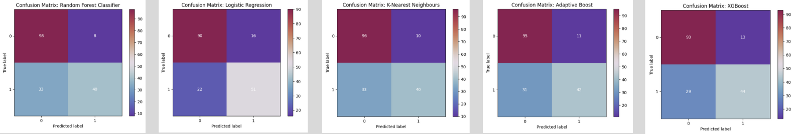

# Titanic Survival Predictor

    

This repository has my code for my [competition submission](https://www.kaggle.com/code/johannaschmidle7/titanic-survival-predictor) for the [Titanic - Machine Learning from Disaster Competition](https://www.kaggle.com/competitions/titanic/overview) on Kaggle.

## Motivation
**Goal:** build a machine learning model to predict if a passenger survived the sinking of the Titanic or not.
For each in the test set, you must predict a 0 or 1 value for the variable (Classifier).

## Metric
Submissions are evaluated on **accuracy**. The score is the percentage of passengers you correctly predict (this is known as accuracy).

## Steps 
1. **EDA**
2. **Feature Engineering**
    - Family Size: Larger families might have different survival rates compared to solo travelers.
    - Person's Title: (ex. Ms, Mr) Titles can provide insight into age, gender, and social status, which might affect survival chances.
    - Cabin Deck: The deck could correlate with proximity to lifeboats and thus survival rates.
    - Cabin Assigned: Passengers who have not been assigned a cabin might have different survival probabilities compared to those with recorded cabin details.
    - Age Group: Different age groups might have had different survival probabilities.
    - Fare Price Groups: I will create different groups of fare price, which can capture non-linear relationships between fare and survival.
    - Name Length: Especially in the early 1900s a person with a longer name could indicate importance which can impact survival rate
4. **Preprocessing**
    1. Dealing With Nulls
    2. Split the Data
    3. Create Pipelines + Transform Columns
5. **Visualize and Understand Data**
    - Histogram
    - KDE
    - Pie Chart
    - Heatmap
6. **Define Models**
   - I created 5 models: 
     - Model 1: Random Forest Classifier
     - Model 2: Logistic Regression
     - Model 3: K-Nearest Neighbours
     - Model 4: XGBoost
     - Model 5: Adaptive Boost
7. **Create Competition Submission**

## Result of Model Evaluations
### Model 1: Random Forest Regressor
- Best Score: 0.834
- Correct: 138
- Incorrect: 41
### Model 2: Logistic Regression
- Best Score: 0.795
- Correct:  141
- Incorrect: 38
### Model 3: K-Nearest Neighbours
- Best Score: 0.829
- Correct: 136
- Incorrect: 43
### Model 4: XGBoost
- Best Score:  0.803
- Correct: 137
- Incorrect: 42
### Model 5: Adaptive Boost
- Best Score: 0.819
- Correct: 137
- Incorrect: 42

## Competition Scores (Best to Worst)
- Model 4: XGBoost - **0.76555**
- Model 2: Logistic Regression - **0.76794**
- Model 5: Adaptive Boost - **0.77751**
- Model 3: K-Nearest Neighbours - **0.77990**
- Model 1: Random Forest Regressor - **0.78229**
  
## Data
The dataset used in this project is available publicly on Kaggle: [https://www.kaggle.com/competitions/titanic/data](https://www.kaggle.com/competitions/titanic/data)

## Technologies
Python
- pandas, numpy, matplotlib, seaborn
- sklearn (OrdinalEncoder, OneHotEncoder, SimpleImputer, make_column_transformer, ColumnTransformer, Pipeline, LogisticRegression, DecisionTreeClassifier, KNeighborsClassifier, RandomForestClassifier, AdaBoostClassifier, cross_val_score, GridSearchCV, ConfusionMatrixDisplay)
- XGBoost
